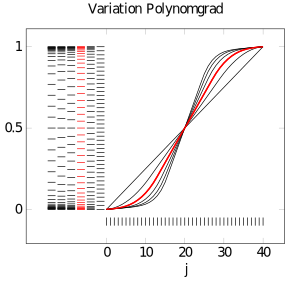
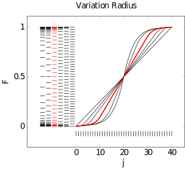

# One-Dimensional Convexification

This packages's focus is the (semi-)convexification of a generalized energy density $W(\boldsymbol{F})$ that depends on the gradient of the solution $\nabla \boldsymbol{u}$.

First, a strategy needs to be instantiated, which only holds the parameters of the convexification, such as discretization interval, size of the discretization etc.
This strategy needs to be of subtype `<: AbstractConvexification` and dispatches `build_buffer`.
The latter mentioned will return a buffer that is needed together with the convexification strategy to call `convexify`.

```@docs
NumericalRelaxation.convexify
```

## Equidistant Convexificationstrategy

```@docs
NumericalRelaxation.GrahamScan
NumericalRelaxation.ConvexificationBuffer1D
```

## Adaptive Convexification
```@docs
NumericalRelaxation.AdaptiveGrahamScan
NumericalRelaxation.AdaptiveConvexificationBuffer1D
```

To reduce the absolute computational cost of the convexification algorithm it is
essential to represent the incremental stress potential $W(\boldsymbol{F})$ on as less grid
points as possible. For accuracy reasons of the resulting convex hull, the
resolution of the grid must be fairly high around the supporting points $F^-$
and $F^+$ of non-convex regions of $W$. In adaptive convexification we first
identify a set of points of interest based on a coarse grid to construct an
adaptive grid in a second step. The adaptive grid then has a high resolution
around the previously identified points and a coarse resolution everywhere
inbetween. An example of the coarse and the adaptive grid can be seen in the
figure below.


#### How to use it

Simply use an instance of `AdaptiveGrahamScan` and build a buffer with `buildbuffer`.
The `convexify` function will then dispatch on the assigned strategy.

```
adaptiveconvexification = AdaptiveGrahamScan(interval=[0.001, 20.001])
buffer = build_buffer(adaptiveconvexification)
W, F⁺, F⁻ = convexify(adaptiveconvexification,buffer,W,Tensor{2,1}((2.0,)))
```

- `interval::Vector{Float64}`
Specifies here the discretization interval for the convexification grid.
In some cases default settings for adaptive convexification will not fit for
the problem at hand. In this case the default values for the keyword arguments

- `basegrid_numpoints::Int64 = 50`
- `adaptivegrid_numpoints::Int64 = 1150`
- `exponent::Int64 = 5`
- `distribution::String = "fix"`
- `stepSizeIgnoreHessian::Float64 = 0.05`
- `minPointsPerInterval::Int64 = 15`
- `radius::Float64 = 3`
- `minStepSize::Float64 = 0.03`
- `forceAdaptivity::Bool = false`

of struct `AdaptiveGrahamScan` must be altered.

In general, select an interval such that it covers all non-convex parts of $W(\boldsymbol{F})$.
`basegrid_numpoints` and `convexgrid_numpoints` must be chosen large enough to
represent all relevant information of $W(\boldsymbol{F})$ but small enough to keep
computational cost low.

To understand how to set the parameters `minStepSize`, `radius` and `exponent`, that
mainly characterize the distribution of the grid points on a given subinterval $[F^-,F+]$
(subinterval between two previously identified points of interest)
of the main interval, correctly, we need to understand how the distribution of the grid
points works mathematically.

For each of the two distribution types there exists a function that maps a vector entry $j$
to to a point on the given subinterval. This function is a piecewisely defined polynomial
of degree $p$. $a$, $b$, $c$, $d$, $j^{-}_{r}$ and $j^{+}_{r}$ are parameters that are
automatically fitted for a specific problem. $j_{max}$ is the number of gridpoints to be
distributed on a given subintervall.

$\begin{align*}
{var}: \mathbb{R} & \longrightarrow \mathbb{R} \\
j & \longmapsto
\left\{\begin{array}{ll} F^- + a \, j^p + b \, j , & \text{if } j < \frac{j_{\max}}{2}, \\
F^+ - \left(a \,(j_{\max} - j)^p + b \,(j_{\max} - j) \right) , & \text{if } j \geq \frac{j_{\max}}{2}. \end{array} \right.
 \end{align*}$


$\begin{align*}
{fix}: \mathbb{R} & \longrightarrow \mathbb{R} \\
j & \longmapsto
\left\{\begin{array}{ll} F^- + a \, j^p + b \, j , & \text{if } j < j^{-}_{r}, \\
c \, j + d, & \text{if } j^{-}_{r} \leq j \leq j^{+}_{r}, \\
F^+ - \left(a \,(j_{\max} - j)^p + b \,(j_{\max} - j) \right) , & \text{if } j > j^{+}_{r}. \end{array} \right.
 \end{align*}$

 For distribution type "var" the function constists of two regions. A polynomial of
 degree $p$ on the first half of the interval $[0, j_{\max}]$ and a mirrored version
 of it on the second half of it. Distribution type "fix" is an extension of type "var"
 that adds a linear part to the middle of the interval. See figures below for examples
 polynomials of type "fix".

 Unless the lengths of all subintervals are almost equal,
 one should not use distribution type "var", since it has the drawback that it results
 in an adaptive grid where the step size between two grid points depends heavily on the
 length ($F^+-F^-$) of the subinterval. This way the resulting grid can have a drastically
 different resolution on either side of a point of interest.

 Always set the parameters of your grid in the following order:

 1. `minStepSize`
 Defines the slope of the polinomial at its start/end point. For $j_{max} \rightarrow \infty$
 the step size of the interval at its start/end point will converge to this value. Should
 be the highest value that still just serves the accuracy requirements.
 Try 0.0015*length\_of\_interval as a starting value.
 2. `radius` (only for type "fix")
 Sets the radius $\Delta F$ around a point of interest in which the step size increases
 to the maximum value. In terms of the mathematical definition of $fix$ this value is used
 to set the parameters $j^{-}_{r}$ and $j^{+}_{r}$, which are the vector indices that define
 the transitions between linear and non-linear parts. See the figure above for the influence of
 this parameter on the resulting polynomial. Also check the figure at the beginning of this
 section to see the resulting adaptive grid. You will notice that the step size of the grid
 increases equally and within a constant radius around all points of interest.
 3. `exponent`
 Sets the exponential "p" of the polynomial. It mainly influences the difference between
 highest and lowest step size. Or in other words, for increasing polynomial degrees the grid
 points will be pushed further towards the start and end points of the interval.
 See figure above for the influence of this parameter on the resulting polynomial.
 4. `convexgrid_numpoints`
 The number of grid points of the adaptive grid must now be chosen intuitively.
 As a starting value choose 20 points per subinterval.




#### Extended Info

```@docs
NumericalRelaxation.adaptive_1Dgrid!
NumericalRelaxation.build_buffer
NumericalRelaxation.convexify_nondeleting!
```
